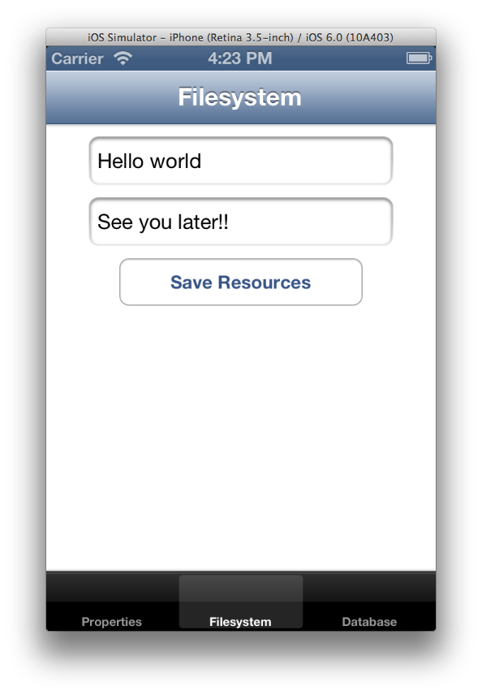

theme:appcelerator
linenumbers:false

# Filesystem APIs

## Appcelerator Certified Developer (ACD) Training

---cover

# Filesystem

## Appcelerator Certified Developer (ACD) Training

---

# In this lession, you will:

- Explore Titanium Filesystem APIs
- Understand how and where to store data on the filesystem
- Understand LocalStorage for use with Mobile Web

---section

# The Filesystem

---

# Filesystem Persistence and Security

- iOS/Android applications have limited Read/Write access to the filesystem
- Filesystem data persists until uninstall, except temp directories
- Filesystem locations are 'sandboxed' and private to your app
- Except external storage on Android
- Mobile Web has no filesystem access

---

# Common Storage Locations

- Ti.Filesystem.resourcesDirectory — read-only
- Ti.Filesystem.applicationDataDirectory — read/write
- Ti.Filesystem.tempDirectory — read/write
- Ti.Filesystem.applicationCacheDirectory — read/write

---

# iOS Filesystem

- applicationDirectory — read-only
- applicationSupportDirectory — read/write
- **remoteBackup** property

---

# Android Filesystem

- Ti.Filesystem.externalStorageDirectory — read/write, not sandboxed
- Ti.Filesystem.isExternalStoragePresent() — returns true/false
- resRawDirectory – Add files to platform/android/res/raw

---code

# Filesystem Example

```javascript
var file = Ti.Filesystem.getFile(Ti.Filesystem.resourcesDirectory, "myfile.txt"); 

var blob = file.read(); // binary representation of blob (file) 

var textOfFile = blob.text; 
var path = file.nativePath; // path to the file 
var mimetype = blob.mimeType; 
// dispose of file handle and blob 
file = null; 
blob = null; (no close() method) 
```
---

# Scaffolding Example



[http://github.com/appcelerator-training/Persistence](http://github.com/appcelerator-training/Persistence)

---section

# LocalStorage API

---

# Local Storage

- In-browser persistent storage location
- Support varies by browser and version
- Typical limit is 5MB — for app, properties, - Appcelerator libraries, etc.
- User can clear at any time via browser tools
- Local Storage == Resources directory in Mobile Web

---

# Summary

**In this lesson, you:**

- Explored Appcelerator Filesystem APIs
- Examined how and where to store data on the filesystem
- Looked at LocalStorage for use with Mobile Web

---section

# Q&A

---


